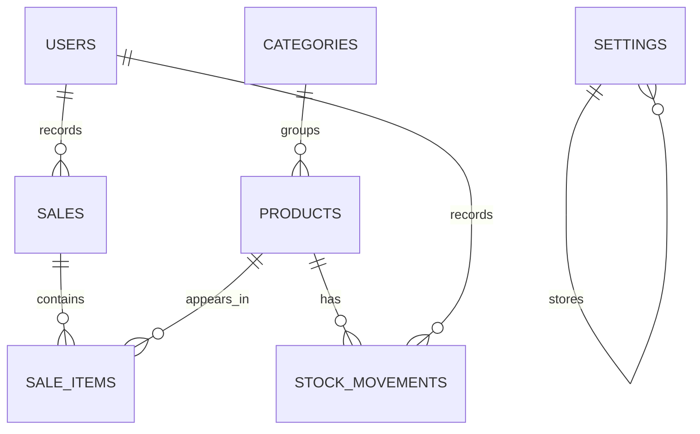

# Technical Documentation

## System Overview

The Inventory Management System is a PHP 8.2+ and MySQL web application for managing products, categories, stock movements, sales, reports, users, profiles, and business settings.

## Architecture

The project uses a small MVC-inspired structure:

```text
app/
  Controllers/
  Core/
  Models/
  Services/
  helpers/
public/
  index.php
  assets/
views/
database/
storage/logs/
```

`public/index.php` registers routes. Controllers validate requests and render views. Models perform database queries through PDO. Services contain business logic such as sales transactions and stock adjustments.

## Technology Stack

- PHP 8.2+
- PDO
- MySQL/MariaDB
- HTML5
- CSS3
- JavaScript
- Bootstrap 5
- Bootstrap Icons

## Database Design

Tables:

- `users`: authorized system users
- `categories`: product categories
- `products`: inventory products and current stock
- `sales`: sale headers and invoice totals
- `sale_items`: products sold within each sale
- `stock_movements`: auditable stock history
- `settings`: business configuration values

## Relationships



## Authentication Workflow

```text
User
 -> Login form
 -> Validate credentials
 -> Verify password hash
 -> Regenerate session
 -> Store user session
 -> Dashboard
```

Passwords use `password_hash()` and `password_verify()`. Inactive users cannot log in.

## Authorization

The app supports `admin` and `staff` roles. Admin users can manage products, categories, stock adjustments, users, settings, and reports. Staff users can view dashboard/product/inventory data, create sales, view receipts, and review sales history.

## Sales Workflow

```text
Select product
 -> Enter quantity
 -> Add one or more sale items
 -> Server validates active products and available stock
 -> Calculate subtotal, discount, total, paid amount, and balance
 -> Begin transaction
 -> Insert sale
 -> Insert sale items
 -> Deduct product quantities
 -> Insert stock movement rows
 -> Commit transaction
 -> Display receipt
```

If any step fails, the transaction rolls back.

Completed sales are treated as immutable records in this academic scope. The system does not provide casual sale deletion because deleting a completed sale would conflict with stock movement history.

## Stock Update Workflow

Stock-in and adjustments select the product row using `FOR UPDATE`, calculate before/after quantities, reject negative results, update `products.quantity`, and insert a `stock_movements` row.

## Sales Concurrency

Sales use both row locking and a conditional update:

```sql
UPDATE products
SET quantity = quantity - :quantity
WHERE id = :product_id
AND quantity >= :quantity
```

If the affected row count is not one, the transaction rolls back. This prevents overselling when two cashiers try to sell the same stock at the same time.

## Security Controls

- PDO prepared statements
- Password hashing
- Session regeneration after login
- CSRF tokens on write forms
- Role checks before protected routes
- Output escaping in views
- Safe delete/deactivate strategy for historical records
- Server-side validation for all important calculations

## Report Generation

Reports use aggregate SQL and filtered database queries. Dashboard values, report totals, and low-stock counts are not hardcoded.

## Error Handling

The router displays consistent 403, 404, and 500 pages. Development debugging can be disabled in `config.php` for production.

## Deployment Considerations

For production hosting, update `config.php`, set `debug` to `false`, change default passwords, configure writable `storage/logs`, and verify `.htaccess` behavior on the target Apache environment.
